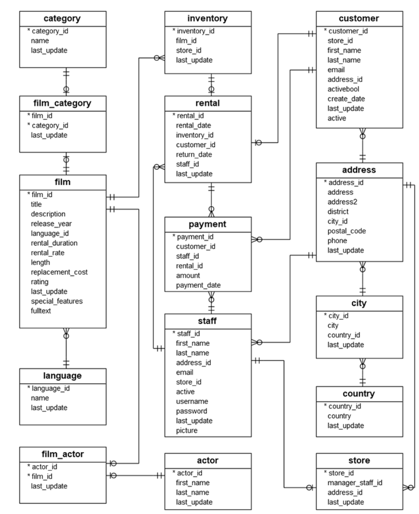

# ms-ai-mvp

---

#### 1. 프로젝트 개요

문제 정의

자연어 쿼리를 실행 가능한 SQL 문으로 변환하는 것은 데이터베이스 스키마의 복잡성과 다양한 사용자 의도 때문에 어려운 과제입니다. 이 프로젝트는 사용자가 자연어를 사용하여 PostgreSQL 데이터베이스를 쿼리할 수 있도록 하여 수동으로 SQL을 작성할 필요를 없애는 것을 목표로 합니다.

대상 사용자
비즈니스 사용자: SQL 전문 지식 없이 데이터베이스에서 인사이트를 추출해야 하는 비기술적 사용자.
개발자: 빠른 프로토타이핑이나 임시 분석을 위해 SQL 쿼리 생성을 간소화하려는 기술적 사용자

---

#### 1. 프로젝트 개요

프로젝트는 RAG 기반의 **자연어에서 SQL로 변환** 을 구현합니다.
Azure OpenAI, Azure AI Search, PostgreSQL을 통합하여 영어 또는 한국어로 작성된 자연어를 안전하고 실행 가능한 SQL SELECT 문으로 변환합니다.
Streamlit 프론트엔드를 통해 사용자 인터랙션을 제공하고, LangChain으로 LLM을 조정하며, Azure Blob Storage를 사용해 스키마를 저장 및 벡터화합니다.

---

#### 2: 아키텍처 다이어그램 (LLM)

---

#### 2: 아키텍처 다이어그램 (Schema update)

---

#### 3: 핵심 구현

<!-- - RAG 구현: Azure AI Search를 통해 스키마 조각과 유사 쿼리를 검색하고, Azure OpenAI를 통해 문맥에 맞는 SQL을 생성하여 정확도를 높입니다. -->

- **안전한 쿼리 실행**: SELECT 전용 트랜잭션, 실행 시간 제한, SQL 검증을 통해 비인가 데이터베이스 작업을 방지합니다.
- 프롬프트 엔지니어링: 프롬프트 템플릿을 맞춤화하여 PostgreSQL 호환 SQL을 JSON 형식으로 출력하고, 투명성을 위해 간결한 추론을 제공합니다.
- **쿼리번역**: Azure Translator를 사용해 한국어쿼리를 영어 쿼리로 번역하여 Vector검색 성능을 높였습니다.
- 스키마 업데이트: Azure Blob Storage에 데이터베이스 스키마를 업데이트 합니다.
- GitHub Actions를 통한 자동 배포: GitHub Actions 워크플로우를 설정하여 코드 변경 시 자동으로 빌드, 테스트, 그리고 Azure Web App에 배포하여 지속적 통합 및 배포(CI/CD)를 구현합니다.

---

#### Live Demo

🏪🏬 Pagila (PostgreSQL Sample Database)

**DVD rental database to demonstrate the features of PostgreSQL.**

[Web App](gwanghun-webapp-001-bmdshddfbme0hng7.westus3-01.azurewebsites.net)

---

#### 5. 향후 개선 및 확장 계획

- 고급 RAG: 벡터 검색 기능을 개선하고 임베딩을 미세 조정하여 스키마 및 쿼리 매칭 정확도를 높입니다.
- 쿼리 최적화: 대규모 데이터셋에서 성능을 향상시키기 위해 SQL 쿼리 최적화 기술을 도입합니다.
- 확장된 언어 지원: 한국어와 영어 외에 추가 언어를 지원합니다.
- UI 개선: Streamlit 앱에 쿼리 기록 저장, 쿼리 편집, 시각화 옵션(예: 차트) 추가.
- 모델 미세 조정: 비용 효율성과 빠른 추론을 위해 소규모 LLM을 미세 조정.

---

#### 질문
